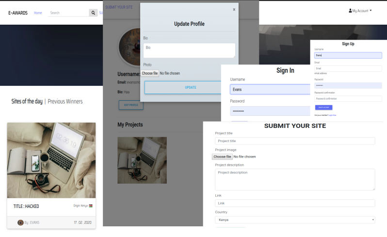

# E~AWARDS
A django generated application that allows users to submit their done projects, get reviewed by other peers(basically other users) by previewing and rating them.

## Author
* Evans ON


### E~AWARDS




## BDD
* Display project:

    - Title

    - Description

    - Ratings

* Add ratings
* Update profile


## Input
* Submit project
* Click a project image
* Click to rate
* Update profile


## Output
* Project 
* Project details
* Project Rated
* Profile updated


## Setup Requirements
  [Here's](https://www.python.org/) a brief intro about what a developer must do in order to start running the app locally:

  ```
  $ git clone https://github.com/jusinam/Ev-Awards.git
  $ cd Ev-Awards/
  ```
  * create a virtual environment
  * Activate the virtual environment
  * ` (virtual)$ pip install -r requerements.txt `
  * create your own database
  * change or add configurations in the settings.py file
  * ` (virtual)$ python3.6 manage.py makemigrations `
  * ` (virtual)$ python3.6 manage.py migrate `
  * ` python3.6 manage.py createsuperuser `

 ```
  $ python3.6 manage.py test awards (To run tests)

 ```
 
Launch the application locally by running the command
     
  ```
  $ python3.6 manage.py runserver

  ```
  
   
## Technologies Used
  * [Python version 3.8.9](https://www.python.org/) . 
  * [Django (django modules)](https://docs.djangoproject.com/en/3.0/intro/tutorial01/).
  * PSQL database.
  * Javascript (jQuery)
  * Google Fonts & Icons
  * MDB Bootstrap
  * POSTMAN

 #### Bugs
The search functionality doesn't work as expected and is under development

## Site Live Link
[Click here](https://evan-award-ups.herokuapp.com/)


## API endpoints
This application comes with two API Endpoints:

- Profiles API Endpoint - https://evan-award-ups.herokuapp.com/api/profiles/ 

- Projects API Endpoint - https://evan-award-ups.herokuapp.com/api/projects/


#### Collaborate
>Incase of any questions, problems or ideas concerning the app, feel free to reach out to me:
>>Email: [Send mail](mailto:evansonchagwa01@gmail.com)

#### License
MIT
&copy;2020 Evans ON
